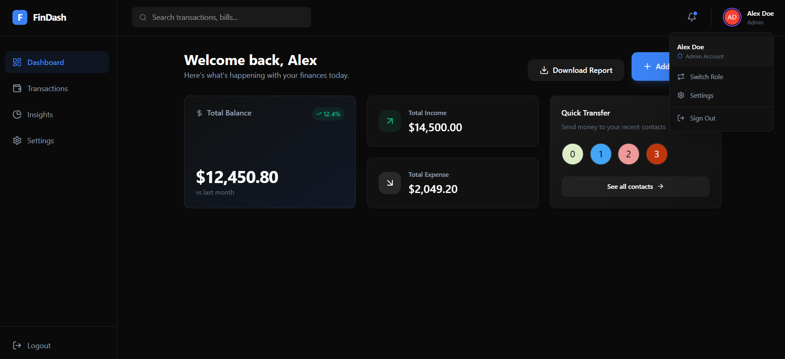
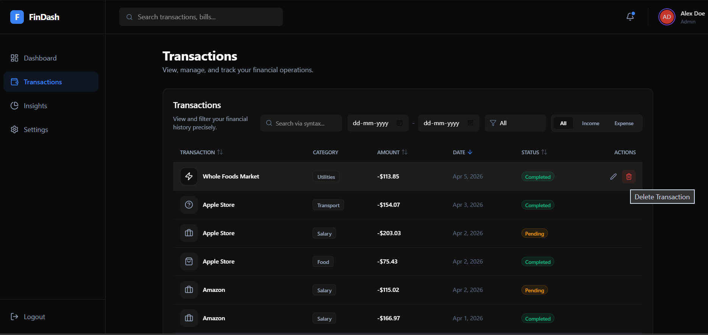
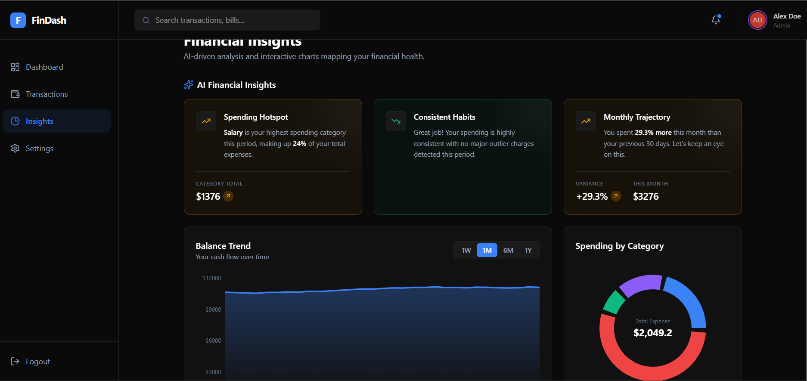

# 💰 Finance Dashboard UI

A modern fintech dashboard built to track financial activity, analyze spending patterns, and generate meaningful insights through an intuitive and responsive interface.

This project goes beyond basic UI by incorporating insights-driven analytics, role-based behavior, and real-world user experience patterns.

## 🚀 Live Demo

👉  https://finance-dashboard-ui-1aem.vercel.app/

## 📸 Screenshots

### Dashboard Overview



### Transactions Page



### Insights Section



## 🧠 Problem Statement

Financial dashboards often either lack usability or fail to present insights clearly.
The goal of this project was to build a dashboard that:

* Presents financial data in a clear and structured way
* Provides useful insights instead of just raw data
* Simulates real-world product behavior with role-based access

## ✨ Key Features

### 📊 Dashboard Overview

* Summary cards for balance, income, and expenses
* Time-based financial trends
* Category-wise expense breakdown

### 💳 Transactions Management

* Transaction listing with date, category, and amount
* Search, filter, and sorting functionality
* Highlighting of key transactions

### 🧠 Smart Insights

* Detects highest spending category
* Month-over-month comparison
* Highlights noticeable spending patterns

### 🔐 Role-Based UI

* **Viewer**: Read-only access
* **Admin**: Can manage transactions and export data
* UI dynamically updates based on role

### 👤 Profile & Role Switching

* Profile dropdown with role selection
* Simulated authentication (no backend)
* State persisted using localStorage

### ⚙️ Settings Page

* Dark mode toggle
* Export data (JSON/CSV)
* Import data
* Reset application data

### 🎨 UI/UX Enhancements

* Fully responsive design
* Smooth animations (Framer Motion)
* Loading states and empty states

## 🛠️ Tech Stack

* **Frontend**: React + TypeScript (Vite)
* **Styling**: Tailwind CSS
* **State Management**: Zustand
* **Charts**: Recharts
* **Animations**: Framer Motion

## 🧩 Architecture
```
src/
 ├── components/
 │    ├── auth/
 │    ├── common/
 │    ├── dashboard/
 │    ├── layout/
 ├── hooks/
 ├── layouts/
 ├── pages/
 ├── store/
 ├── types/
 ├── utils/
 └── assets/
```

## ⚡ Getting Started

### 1. Clone the repository

```bash
git clone https://github.com/Himali-Silwadiya/finance-dashboard-ui.git
cd finance-dashboard-ui
```

### 2. Install dependencies

```bash
npm install
```

### 3. Run the development server

```bash
npm run dev
```

## 🌟 Advanced Features

* LocalStorage persistence for data and user preferences
* Multi-page routing using React Router
* CSV & JSON export functionality
* Import data support with validation
* Smooth UI transitions and interactions

## 🧪 Edge Case Handling

* Handles empty transaction data gracefully
* Validates imported JSON files
* Prevents UI breaking on invalid inputs
* Responsive across devices and screen sizes

## 📈 What Makes This Project Different

* Focus on **real product experience**, not just UI
* Insights-driven dashboard instead of static charts
* Clean and scalable frontend architecture
* Thoughtful UX decisions (states, transitions, flows)

## 📌 Future Improvements

* Backend integration (Node.js + database)
* Authentication system (JWT / OAuth)
* Real-time financial data APIs
* Advanced analytics and predictions

## 📬 Contact

* GitHub: https://github.com/Himali-Silwadiya
* LinkedIn: https://www.linkedin.com/in/himali-silwadiya

